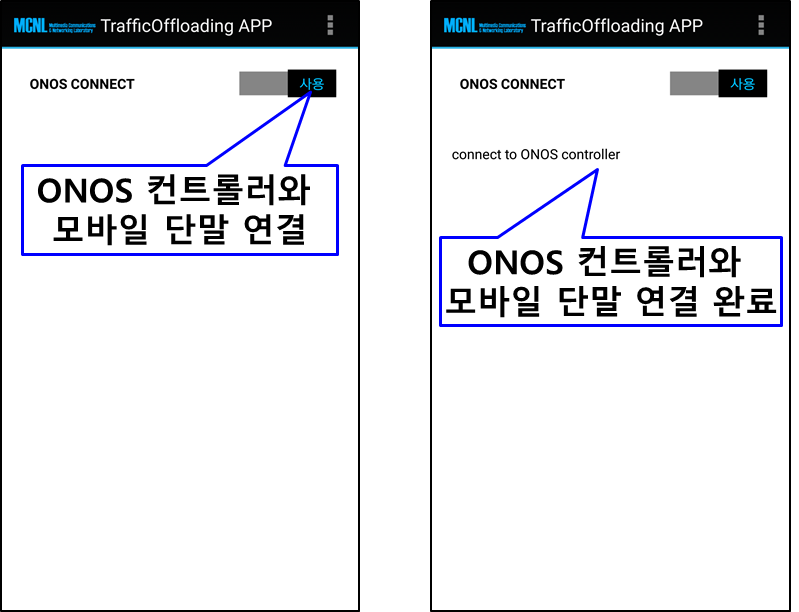
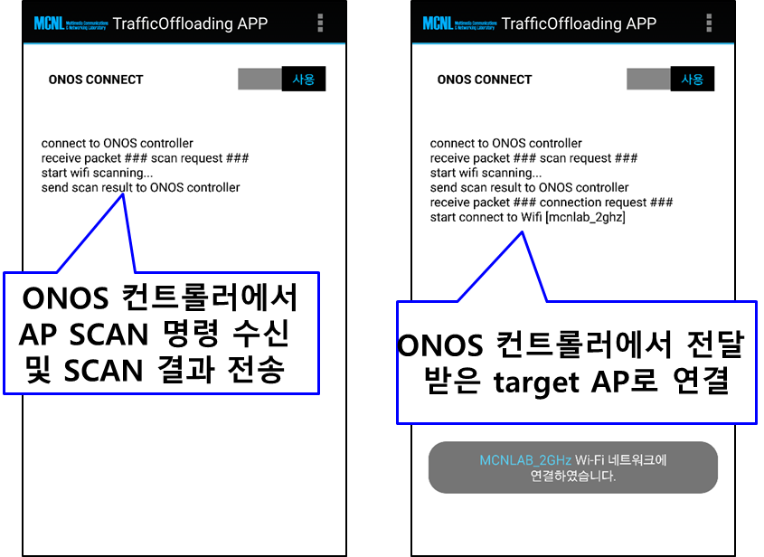

#1. Software-defined mobile traffic offloading system
사용자는 이용 가능한 AP (Access Point)중 신호세기를 보고 모바일 단말과 연결할 AP를 선택할 수 있습니다. 하지만 연결된 AP에 과도한 트래픽이 흐르고 있다면 사용자는 만족할 만한 무선 통신 서비스를 받을 수 없게 됩니다. 따라서 AP의 트래픽을 모니터링 하여 모바일 단말의 연결의 관리해주는 프로그램이 필요합니다.
본 프로그램은 이에 대한 필요성에 의해 SDN (Software Defined Networking) 컨트롤러인 ONOS를 사용하여 AP의 트래픽을 모니터링 하고, 모바일 단말과 AP의 연결을 관리해주기해 ONOS Application과 Android Application으로 개발 되었습니다.

<figcaption>Figure 1. System architecture</figcaption>

##2. 안드로이드 트래픽 오프로딩 어플리케이션
일반적으로 AP 에 연결된 모바일 단말들이 내부 IP 주소를 할당 받기 때문에 컨트롤러가 모바일 단말들을 인지하기 위해서는 단말들의 최소한의 지원이 필요합니다. 즉, 모바일 단말들은 초기 접속 시 ONOS SDN 컨트롤러에게 자신의 내부/외부IP주소를 전달하고 컨트롤러는 모바일 사용자를 등록합니다. 이러한 방식으로 컨트롤러는 제어 가능한 모바일 사용자를 관리할 수 있으며 주기적으로 모바일 단말들과 통신하여 AP 탐색, AP 핸드오버 등과 같은 명령을 수행하게 됩니다. 

모바일 단말이 ONOS SDN 컨트롤러에게 자신의 내부/외부 IP를 전달 하기 위해서는 ONOS SDN 컨트롤러의 IP를 알아야 합니다. Figure 1과 같이 ONOS SDN 컨트롤러의 IP를 설정할 수 있으며, Figure 2와 같이 ONOS CONNECT 스위치를 통해 모바일 단말을 ONOS SDN 컨트롤러에 등록 시킬 수 있습니다.

<figcaption>Figure 2. 안드로이드 어플리케이션 실행 화면 (ONOS SDN 컨트롤러 IP 설정).</figcaption>

<figcaption>Figure 3. 안드로이드 어플리케이션 실행 화면 (ONOS SDN 컨트롤러와 모바일 단말 연결).</figcaption>

ONOS SDN 컨트롤러는 트래픽 오프로딩을 수행할 모바일 단말을 정하기 위해서 모바일 단말에 SCAN 명령을 전송하여 주위 AP 정보 스캔을 요청합니다. 이러한 요청을 받은 모바일 단말은 AP 스캔을 수행하고 ONOS SDN 컨트롤러에 결과를 보고합니다 (Figure 4 (a)). ONOS SDN 컨트롤러는 AP 스캔 정보와 AP 트래픽 모니터링 정보를 이용하여 트래픽 오프로딩을 수행할 모바일 단말과 AP (Target AP)를 결정하고 해당 모바일 단말에 CONNCET 명령을 보내 Target AP로 핸드오버를 요청하게됩니다 (Figure 4 (b)). ONOS SDN 컨트롤러의 동작은 https://github.com/MobileConvergenceLab/TrafficOffloadingONOS 를 참고해주시길 바랍니다.

<figcaption>Figure 4. 안드로이드 어플리케이션 실행 화면 (a) SCAN 명령 수행 (b) CONNECT 명령 수행.</figcaption>

